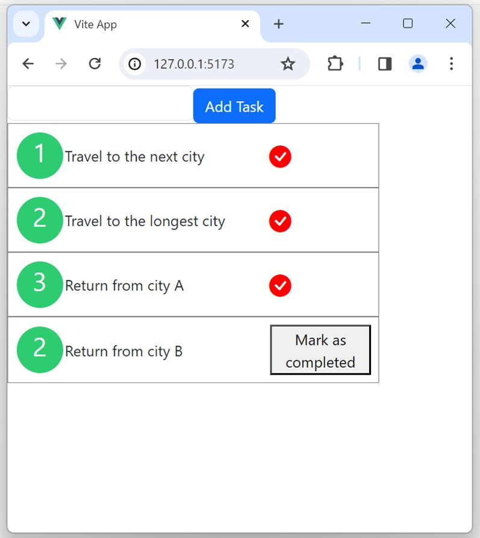

# vuejs_crud_axios

This app aim to show how to use Vue with axios to integrate with backend.
 

## Project Setup

```sh
npm install
npm install bootstrap@5.3.0-alpha3
npm i bootstrap-icons
```

### Run backend (Json Server will be served in port: 3000)

```sh
npm run start
```

### Compile and Hot-Reload for Development (App will be served in port: 5173)

```sh
npm run dev
```

### Compile and Minify for Production

```sh
npm run build
```
